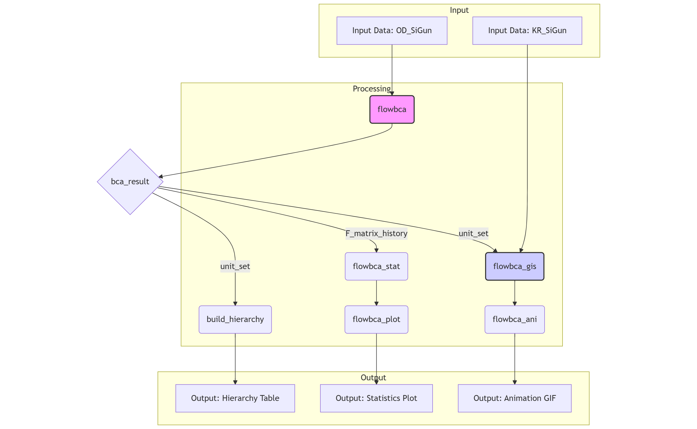

<!-- README.md is generated from README.Rmd. Please edit that file -->

```{r, include = FALSE}
knitr::opts_chunk$set(
  collapse = TRUE,
  comment = "#>",
  fig.path = "man/figures/README-",
  out.width = "100%")
```

# flowbcaR

<!-- badges: start -->
<!-- badges: end -->

`flowbcaR`은 Stata 패키지 `flowbca`를 R로 번역한 것으로, 흐름 데이터를 위한 계층적 클러스터링 알고리즘입니다. 이 패키지는 행정 구역과 같은 공간 단위 간의 상호작용(예: 인구 이동)을 분석하여 기능적 권역을 식별하는 데 사용됩니다. 또한, flowbcaR에서는 알고리즘 결과를 이해하기 위한 다양한 함수를 추가로 제공합니다.

## Background and Methodology

`flowbcaR`는 Meekes and Hassink (2018)가 개발한 Stata용 `flowbca` 알고리즘에 기반합니다. 이 알고리즘은 단위 간의 **흐름(flow)**에 초점을 맞춘 응집형 계층적 클러스터링(agglomerative hierarchical clustering) 방법입니다.

알고리즘의 핵심 아이디어는 다음과 같습니다:

1.  **초기 상태**: 모든 개별 단위(예: 지역)를 별개의 클러스터로 시작합니다.
2.  **최적화 함수**: 각 단계에서 모든 단위 쌍 간의 양방향 흐름을 평가합니다. 최적화 함수는 가장 강한 상호작용을 보이는 두 단위를 식별합니다. 이때 흐름은 다음과 같은 기준으로 평가될 수 있습니다.
    - **방향성**: 단방향(directed) 흐름 또는 양방향(undirected) 흐름의 합.
    - **척도**: 절대적(absolute) 흐름량 또는 총 유출량 대비 상대적(relative) 흐름량.
3.  **병합**: 최적화 함수에 따라 선택된 두 단위 중, 더 큰 흐름을 받는 단위(destination unit)를 중심으로 다른 단위(source unit)가 병합됩니다. 이때, 받는 단위(destination unit)는 중심지(core)로 정의됩니다.
4.  **반복**: 모든 단위가 하나의 클러스터가 되거나, 사용자가 지정한 중단 조건(예: 목표 클러스터 개수, 최소 흐름 임계값)이 충족될 때까지 2-3단계를 반복합니다.

이 방법론은 지역 경제권 분석, 산업 연관 분석, 사회 연결망 분석 등 다양한 분야에서 유용하게 사용될 수 있습니다. 클러스터링 후에는 내부 흐름 비율(internal relative flow)과 같은 지표를 통해 형성된 클러스터의 자족성(self-containment)을 평가할 수 있습니다.

## Installation

개발 버전은 [GitHub](https://github.com/)에서 다음 명령어로 설치할 수 있습니다:

```{r, eval=FALSE}
# install.packages("pak")
pak::pak("urbanjj/Rflowbca")
```

## Analysis Workflow

`flowbcaR`의 함수들은 체계적인 분석 흐름을 따릅니다. 각 함수는 이전 단계의 출력을 입력으로 사용하여 점진적으로 분석을 구체화합니다. 일반적인 작업 흐름은 다음과 같습니다.

1.  **`flowbca()`**: 원본 흐름 데이터(`OD_SiGun`)를 사용하여 클러스터링을 수행합니다. 결과물은 `unit_set`, `cluster_set`, `F_matrix_history` 등을 포함하는 리스트입니다.
2.  **`build_hierarchy()`**: `flowbca()`의 `unit_set`을 받아 각 단위의 병합 계층을 텍스트로 생성합니다. 병합계층은 data.tree 패키지를 사용해 text 형태로 tree구조를 쉽게 파악할 수 있습니다.
3.  **`flowbca_stat()`**: `flowbca()`의 `F_matrix_history`를 사용하여 클러스터링 각 단계의 통계적 특성을 계산합니다. 클러스터의 자족성(self-containment)에 대한 평균, 중간값, 최대값, 최소값 등을 제시합니다.
4.  **`flowbca_plot()`**: `flowbca_stat()`의 결과를 시각화하여 클러스터 응집력의 변화를 보여줍니다. upper_bound 수가 20개 미만일 때 값이 표현되도록 동적으로 구현되어 있습니다.
5.  **`flowbca_gis()`**: `flowbca()`의 `unit_set`과 원본 공간 데이터(`KR_SiGun`)를 결합하여 각 클러스터링 단계에 해당하는 지도 레이어를 생성합니다. 병합된 polygon 내부의 구멍(hole)을 제거해 시각화를 위한 지도를 제공합니다.
6.  **`flowbca_ani()`**: `flowbca_gis()`가 만든 지도 레이어들을 모아 클러스터링 과정을 동적인 GIF 애니메이션으로 만듭니다. 단계에 따라 병합되는 과정을 알 수 있습니다.

아래 다이어그램은 이러한 함수 간의 관계와 데이터 흐름을 시각적으로 보여줍니다. `flowbca()` 함수의 결과물을 활용하여, 계층적 구조, 클러스터의 자족성에 대한 통계 및 시각화, 시각화를 위한 gis 자료와 애니메이션을 생성합니다.

```{r workflow-diagram-png, echo=FALSE, out.width="100%"}

```

## Sample Data

이 패키지에는 대한민국의 시군(Si-Gun) 단위를 기준으로 한 두 개의 예제 데이터셋이 포함되어 있습니다. `data()` 명령어를 사용하여 불러올 수 있습니다.

-   **`OD_SiGun`**: 159개 시군 간의 통행량을 나타내는 OD(Origin-Destination) 데이터입니다.
-   **`KR_SiGun`**: 159개 시군의 행정구역 경계를 담고 있는 `sf` 공간 데이터입니다.

`flowbca()` 함수에 데이터를 입력하기 전, 올바른 형식으로 맞춰주는 전처리 과정이 필요합니다. `flowbca()`는 Origin-Destination matrix 형태의 data.frame이 입력되어야 합니다. `OD_SiGun` 데이터에는 출발지 코드(`SiGun_CD`)와 이름(`SiGun_NM`)이 모두 포함되어 있지만, 함수는 출발지 ID를 나타내는 **하나의 열**만 필요합니다.

또한, 첫 번째 열의 출발지 ID와 나머지 열의 목적지 ID(열 이름)가 정확히 일치해야 합니다. 여기서는 `SiGun_NM`를 ID로 사용하고, 불필요한 `SiGun_CD` 열을 제거하여 데이터를 준비합니다.

```{r prepare-data, echo=TRUE}
library(flowbcaR)
library(sf)

# Load the sample datasets
data(OD_SiGun)
data(KR_SiGun)

# Prepare the flow data for the algorithm
# The first column must be the source unit ID, and the destination column
# names must match the source unit IDs.
# We remove the first column ("SiGun_CD") to meet this requirement.
flow_input <- OD_SiGun[, -1]
colnames(flow_input) <- c('SiGun_NM',flow_input[,1])

# Check the prepared data
print("Prepared OD Data for flowbca:")
print(flow_input[1:5, 1:6])

print("\nGIS Data:")
print(head(KR_SiGun))
```

## Core Functions


`flowbcaR` 패키지는 데이터 클러스터링, 계층 구조 생성, 통계 분석 및 시각화를 위한 여러 핵심 함수를 제공합니다.

### `flowbca()`

흐름 데이터를 기반으로 계층적 클러스터링을 수행하는 핵심 함수입니다. Stata의 `flowbca.ado` 로직을 따르며, 다양한 병합 기준과 중단 조건을 설정할 수 있습니다.

-   **`data`**: 첫 번째 열이 출발지 ID이고 나머지가 목적지별 흐름량인 데이터 프레임.
-   **`q`**: 클러스터 병합을 위한 최소 흐름량 임계값. 상대적 임계값은 비율로, 절대적 임계값은 정수로 지정합니다. 만약 지정한 임계값이 전체 흐름 값 중 최대값보다 크면, 알고리즘의 중지 조건이 충족되어 절차가 종료됩니다. 기본값은 q(0)입니다.
-   **`k`**: 목표 클러스터 개수.
-   **`opt_f`**: 최적화 함수 (1-4). 4개의 옵션이 가능합니다.
  - opt_f(1): directed relative flows approach, 기본값에 해당함.
  - opt_f(2): undirected relative flows approach
  - opt_f(3): directed absolute flows approach
  - opt_f(4): undirected absolute flows approach
-   **`la`, `lw`, `lm`**: 내부 흐름 비율에 기반한 추가적인 중단 조건.
  - la: the minimum average of the internal relative flows.
  - lw: the minimum weighted average of the internal relative flows.
  - lm: the minimum internal relative flow.
- **`save_k`** : 모든 round에 대한 F_matrix를 반환할지 여부. 기본값은 FALSE임.

```{r example}
# The 'flow_input' data was prepared in the chunk above.
# We will run the clustering until the minimum internal relative flow ratio exceeds 10%.
# By setting lm to 0.1, we ensure that all objects include more than one Si and Gun.
bca_result <- flowbca(flow_input, lm=0.1, save_k = TRUE)

# The result is a list containing:
# 1. unit_set: Details of cluster assignment for each unit
# 2. cluster_set: Statistics for the final clusters
# 3. F_matrix: The final aggregated flow matrix
# 4. F_matrix_history: A list of matrices from each clustering round
str(bca_result$unit_set, 3)
str(bca_result$cluster_set, 3)
```

### `build_hierarchy()`

`flowbca` 결과의 `unit_set`을 사용하여 각 단위(unit)가 어떻게 상위 클러스터에 병합되는지를 보여주는 계층 경로를 생성합니다.

-   **`data`**: `flowbca` 결과의 `unit_set` 데이터 프레임.
-   **`child_col`**: 자식 단위 열 이름 (기본값: "sourceunit").
-   **`parent_col`**: 부모 단위 열 이름 (기본값: "destinationunit").

```{r hierarchy}
# Build the hierarchy path from the result
hierarchy_data <- build_hierarchy(bca_result$unit_set)

# View the hierarchy for a few units
# 'hierarchy' column shows the full merge path
# 'h_level' shows the depth in the hierarchy
head(hierarchy_data[, c("sourceunit", "clusterid", "hierarchy", "h_level")])
```

data.tree 패키지를 활용해 클러스터의 hierarchy를 text로 시각화할 수 있습니다.

```{r data.tree}
library(data.tree)
# data.tree 패키지
node <- paste0('nation/', hierarchy_data$hierarchy)
tree <- data.tree::as.Node(data.frame(pathString=node))

## 클러스터의 hierarchy의 tree 구조
print(tree, 'level', limit=10)

## Busan에 대한 하위 tree구조를 탐색
print(tree$Daegu)

```

### `flowbca_stat()` & `flowbca_plot()`

클러스터링 과정의 각 단계(round)별로 내부 흐름 비율의 통계를 계산하고 시각화합니다. 이를 통해 클러스터의 응집력이 어떻게 변하는지 파악할 수 있습니다.

-   **`flowbca_stat(matrix_list)`**: `flowbca` 결과의 `F_matrix_history`를 입력받아 각 라운드별 평균, 최소, 중앙, 최대 내부 흐름 비율을 계산합니다.
-   **`flowbca_plot(stat_data)`**: `flowbca_stat`이 생성한 데이터를 사용하여 통계치를 그래프로 그립니다.

```{r stat_plot, fig.show='hold', out.width="100%", fig.width=10,fig.height=5}
# Calculate internal flow statistics from the matrix history
stat_data <- flowbca_stat(bca_result$F_matrix_history)
head(stat_data)

# Plot the statistics
# The x-axis represents the number of clusters + 1
par(mfrow = c(1, 2))
flowbca_plot(stat_data, upper_bound = 50)
flowbca_plot(stat_data, upper_bound = 20)
```

### `flowbca_gis()`

`flowbca`의 클러스터링 결과를 공간 데이터(`sf` 객체)와 결합하여 각 병합 단계별로 통합된 폴리곤 레이어를 생성합니다.

-   **`unit_set`**: `flowbca` 결과의 `unit_set`.
-   **`unit_gis`**: 원본 단위의 `sf` 공간 데이터.
-   **`join_col`**: 두 데이터를 결합할 때 사용할 열 이름.
  - (예) join_col = c('join column name of unit_set', 'join column name of unit_gis')

```{r gis, out.width="100%", fig.width=10,fig.height=10}
# Generate merged spatial layers for each round
# This can take a moment
gis_layers <- flowbca_gis(bca_result$unit_set, KR_SiGun, join_col=c('sourceunit'='SiGun_NM'))

# The result is a named list of sf objects
# The names correspond to the round number (number of clusters + 1)
print(paste("Number of spatial layers created:", length(gis_layers)))

# Plot the final clustered boundaries
# The colors for each round are assigned arbitrarily
par(mfrow = c(2, 2),       
    mar = c(0.1, 0.1, 1, 0.1),
    oma = c(0, 0, 0, 0),
    xpd = NA)
plot(gis_layers$`160`["sourceunit"],key.pos = NULL,reset = FALSE,main = "160",asp=NA)
plot(gis_layers$`100`["sourceunit"],key.pos = NULL,reset = FALSE,main = "100",asp=NA)
plot(gis_layers$`50`["sourceunit"],key.pos = NULL,reset = FALSE,main = "50",asp=NA)
plot(gis_layers$`14`["sourceunit"],key.pos = NULL,reset = FALSE,main = "14",asp=NA)
```

### `flowbca_ani()`

`flowbca_gis`가 생성한 공간 레이어 리스트를 사용하여 클러스터링 과정을 보여주는 GIF 애니메이션을 만듭니다.

-   **`flowbca_gis`**: `flowbca_gis` 함수의 결과물.
-   **`unit_set`**: `flowbca` 결과의 `unit_set`.
-   **`filenm`**: 저장할 GIF 파일 이름.
-   **`width`**: 저장할 GIF의 가로 픽셀 값. 기본값은 1000px.
-   **`keep_frames`: GIF에 대한 모든 frame을 현재 경로에 폴더를 생성하고 저장. 기본값은 FALSE.

```{r animation, eval=FALSE}
# This code is not evaluated in the README build to save time,
# but you can run it locally.
# It will create a file named "flowbca_clustering.gif" in your working directory.

flowbca_ani(
  flowbca_gis = gis_layers,
  unit_set = bca_result$unit_set,
  filenm = "flowbca_clustering.gif",
  width = 800
)
```


## References

Meekes, J., & Hassink, W. H. J. (2018). flowbca: A flow-based cluster algorithm in Stata. *The Stata Journal*, *18*(3), 564–584.
