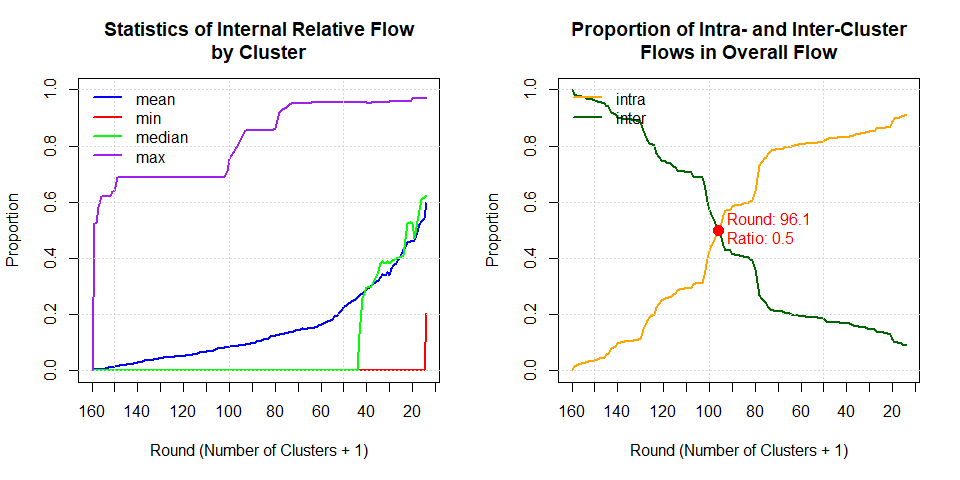
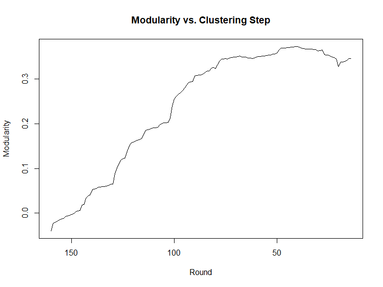
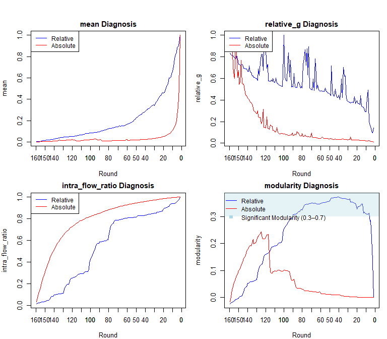

# Introduction to flowbcaR

### *Jongjin Yun (2025-07-29)*

`flowbcaR` is an R implementation of the Stata package flowbca, a
hierarchical clustering algorithm designed for flow data.

-   This package is used to identify functional regions by analyzing
    interactions between units, such as population movement or trade.
-   Beyond clustering, `flowbcaR` offers a comprehensive suite of tools
    for regional and social network analysis, including evaluation,
    diagnosis, and visualization.
-   First, it provides indicators such as `modularity`,
    `inter_flow_ratio`, and `relative_g`, which allow users to compare
    clustering results at each steps.
-   Second, it converts the cluster hierarchy into a textual format,
    making the structure easier to interpret.
-   Third, it includes a function to bridge the gap between statistical
    clustering results and their geographic representation, linking
    clusters with spatial units.
-   Additionally, `flowbcaR` supports stepwise animations to visualize
    the dynamic process of spatial clustering.

## Background and Methodology

The `flowbca` algorithm, developed by Meekes and Hassink (2018), is an
agglomerative hierarchical clustering method that focuses on the
**flow** between units.

The core idea is as follows:

1.  **Initial State**: Every unit (e.g., a city or county) starts as its
    own cluster.
2.  **Optimization Function**: At each step, the algorithm identifies
    the pair of units with the strongest interaction based on a chosen
    optimization function. This function can consider:
    -   **Directionality**: Directed (A -&gt; B) or undirected (A
        &lt;-&gt; B) flows.
    -   **Scale**: Absolute flow volume or relative flow volume (as a
        proportion of total outflow).
3.  **Merging**: The unit with the smaller outflow in the pair is merged
    into the unit with the larger inflow, which becomes the new
    cluster’s core.
4.  **Iteration**: This process repeats, merging pairs and recalculating
    flows for the new, larger clusters, until only one cluster remains
    or a user-defined stopping condition is met.

## Analysis Workflow

The functions in `flowbcaR` are designed to be used in a sequential
workflow, where the output of one function serves as the input for the
next. This allows for a comprehensive analysis, from initial clustering
to final visualization.

A typical workflow involves these steps:

1.  **`flowbca()`**: The core function that performs hierarchical
    clustering on the flow data.
2.  **`build_hierarchy()`**: Creates a textual representation of the
    cluster hierarchy, showing how individual units are merged.
3.  **`flowbca_stat()` & `flowbca_plot()`**: Calculate and visualize
    basic statistics (e.g., internal flow ratios) to help assess cluster
    cohesion at each step.
4.  **`flowbca_modularity()`**: Computes network modularity, an advanced
    metric used to assess the quality of clusters at each step, and to
    facilitate comparison with other network clustering algorithms.
5.  **`flowbca_diagnosis()`**: Provides a diagnostic dashboard and
    statistical outputs to compare clustering strategies based on
    relative and absolute flows, using metrics from `flowbca_stat` and
    `flowbca_modularity`.
6.  **`flowbca_gis()` & `flowbca_ani()`**: Generate spatial
    visualizations, creating maps of the clusters at different stages
    and animating the entire merging process.

## Sample Data

The package includes two datasets for the Si-Gun administrative units of
South Korea.

-   **`OD_SiGun`**: Origin-Destination (OD) data representing passenger
    flow between 159 Si-Gun units.
-   **`KR_SiGun`**: An `sf` object containing the administrative
    boundaries for the 159 Si-Gun units.

Before using the data, it needs to be prepared. The `flowbca()` function
requires a `data.frame` where the first column contains unique source
unit IDs, and the remaining column names are the corresponding
destination unit IDs.

    library(flowbcaR)
    library(sf)
    #> Warning: package 'sf' was built under R version 4.4.2
    #> Linking to GEOS 3.12.2, GDAL 3.9.3, PROJ 9.4.1; sf_use_s2() is TRUE

    # Load the sample datasets
    data(OD_SiGun)
    data(KR_SiGun)

    # Prepare the flow data for the algorithm
    # The first column must be the source unit ID, and the destination column
    # names must match the source unit IDs.
    # We remove the first column ("SiGun_CD") to meet this requirement.
    flow_input <- OD_SiGun[, -1]
    colnames(flow_input) <- c('SiGun_NM',flow_input[,1])

    # Check the prepared data
    print("Prepared OD Data for flowbca:")
    #> [1] "Prepared OD Data for flowbca:"
    print(flow_input[1:5, 1:6])
    #>   SiGun_NM       Seoul      Busan     Daegu      Gunwi      Incheon
    #> 1    Seoul      0.0000 16171.4811 11146.857   88.40104 368358.14742
    #> 2    Busan  15730.4194     0.0000  9497.000  178.31485   1902.12199
    #> 3    Daegu  10831.0608  8518.5377     0.000 5281.25091   1216.73656
    #> 4    Gunwi    110.2699   126.1911  5000.186    0.00000     33.69141
    #> 5  Incheon 360859.4975  1404.4627  1003.667   20.21733      0.00000
    print(head(KR_SiGun))
    #> Simple feature collection with 6 features and 2 fields
    #> Geometry type: GEOMETRY
    #> Dimension:     XY
    #> Bounding box:  xmin: 746111 ymin: 1660757 xmax: 1164133 ymax: 2001991
    #> Projected CRS: KGD2002 / Unified CS
    #>   SiGun_CD SiGun_NM                           geom
    #> 1       11    Seoul POLYGON ((949431.3 1939061,...
    #> 2       21    Busan MULTIPOLYGON (((1133178 167...
    #> 3       22    Daegu POLYGON ((1106848 1755473, ...
    #> 4       23  Incheon MULTIPOLYGON (((927769.5 19...
    #> 5       24  Gwangju POLYGON ((954859.6 1680843,...
    #> 6       25  Daejeon POLYGON ((993018.2 1801216,...

## Core Functions

### `flowbca()`

This is the main function that runs the clustering algorithm. It follows
the logic of Stata’s `flowbca.ado` and allows setting various merging
criteria and stopping conditions.

-   **Features**:
    -   Implements the complete `flowbca` logic, including the detailed
        tie-breaking rules from the original Mata(Stata) implementation.
    -   Offers four optimization functions (`opt_f`) for
        directed/undirected and relative/absolute flows.
        -   `opt_f = 1`: directed relative flows approach (default).
        -   `opt_f = 2`: undirected relative flows approach.
        -   `opt_f = 3`: directed absolute flows approach.
        -   `opt_f = 4`: undirected absolute flows approach.
    -   Provides multiple stopping conditions (`q`, `k`, `la`, `lw`,
        `lm`) for fine-grained control over the clustering process.
        -   `q`: The minimum flow threshold for merging clusters. A
            relative threshold is specified as a ratio, and an absolute
            threshold is specified as an integer. If the specified
            threshold is greater than the maximum value in the entire
            flow data, the algorithm’s stopping condition is met, and
            the procedure terminates. The default is `q = 0`.
        -   `k`: The target number of clusters.
        -   `la`: the minimum average of the internal relative flows.
        -   `lw`: the minimum weighted average of the internal relative
            flows.
        -   `lm`: the minimum internal relative flow.
    -   `save_k`: Specifies whether to return the F\_matrix and
        C\_matrix for all iterations. Defaults to FALSE.
-   **Usage**:

<!-- -->

    # Run clustering until the minimum internal relative flow (lm) is at least 0.1 (10%).
    # save_k=TRUE is important to retain data for subsequent analysis functions.
    bca_result <- flowbca(flow_input, lm = 0.1, save_k = TRUE)
    #> Stopping: Condition (la, lw, or lm) met.

    # The result is a list containing:
    # 1. unit_set: Details of cluster assignment for each unit.
    # 2. cluster_set: Statistics for the final clusters.
    # 3. F_matrix: The final aggregated flow matrix.
    # 4. F_matrix_history: A list of matrices from each clustering round.
    # 5. C_matrix_history: A list of transformation matrices.
    str(bca_result$unit_set, 3)
    #> 'data.frame':    159 obs. of  6 variables:
    #>  $ sourceunit     : chr  "Seoul" "Busan" "Daegu" "Gunwi" ...
    #>  $ clusterid      : chr  "Seoul" "Busan" "Daegu" "Daegu" ...
    #>  $ destinationunit: chr  NA NA NA "Daegu" ...
    #>  $ g              : num  NA NA NA 0.393 0.594 ...
    #>  $ round          : int  NA NA NA 41 101 NA NA 115 49 79 ...
    #>  $ core           : num  1 1 1 0 0 1 1 0 0 0 ...
    str(bca_result$cluster_set, 3)
    #> 'data.frame':    13 obs. of  8 variables:
    #>  $ clusterid        : chr  "Seoul" "Busan" "Daegu" "Gwangju" ...
    #>  $ internal         : num  16091461 1478652 1019695 285361 517083 ...
    #>  $ rowflows         : num  16607708 1748088 1237943 456819 848576 ...
    #>  $ internal_relative: num  0.969 0.846 0.824 0.625 0.609 ...
    #>  $ La               : num  0.6 0.6 0.6 0.6 0.6 ...
    #>  $ Lw               : num  0.91 0.91 0.91 0.91 0.91 ...
    #>  $ Lm               : num  0.205 0.205 0.205 0.205 0.205 ...
    #>  $ N                : num  22376808 22376808 22376808 22376808 22376808 ...

-   **Considerations**:
    -   The choice of `opt_f` and stopping criteria can significantly
        affect the results. It’s often useful to experiment with
        different settings.
    -   For very large datasets (many thousands of units), the process
        can be computationally intensive.

### `build_hierarchy()`

This function processes the `unit_set` to make the clustering hierarchy
explicit and easier to understand.

-   **Features**:
    -   Generates a clear, slash-separated path string for each unit
        (e.g., `TopCluster/SubCluster/Unit`).
    -   Calculates the hierarchy level (`h_level`) for each unit.
-   **Usage**:

<!-- -->

    # Build the hierarchy path from the result
    hierarchy_data <- build_hierarchy(bca_result$unit_set)

    # View the hierarchy for a few units
    head(hierarchy_data[, c("sourceunit", "clusterid", "hierarchy", "h_level")])
    #>   sourceunit clusterid     hierarchy h_level
    #> 1      Seoul     Seoul         Seoul       1
    #> 2      Busan     Busan         Busan       1
    #> 3      Daegu     Daegu         Daegu       1
    #> 4      Gunwi     Daegu   Daegu/Gunwi       2
    #> 5    Incheon     Seoul Seoul/Incheon       2
    #> 6    Gwangju   Gwangju       Gwangju       1

-   **Pros**:
    -   Excellent for understanding the nested structure of the
        clusters.
    -   The output can be easily used with other packages like
        `data.tree` for visualization.

<!-- -->

    library(data.tree)
    #> Warning: package 'data.tree' was built under R version 4.4.3
    # Create a pathString for data.tree
    hierarchy_data$pathString <- paste("Korea", hierarchy_data$hierarchy, sep="/")
    tree <- as.Node(hierarchy_data, pathName="pathString")
    # Print the top levels of the tree
    print(tree, "level", limit=10)
    #>                          levelName level
    #> 1  Korea                               1
    #> 2   ¦--Seoul                           2
    #> 3   ¦   ¦--Incheon                     3
    #> 4   ¦   ¦--Suwon                       3
    #> 5   ¦   ¦--Seongnam                    3
    #> 6   ¦   ¦--Uijeongbu                   3
    #> 7   ¦   ¦--Anyang                      3
    #> 8   ¦   ¦--Bucheon                     3
    #> 9   ¦   ¦--Gwangmyeong                 3
    #> 10  ¦   °--... 49 nodes w/ 13 sub     3
    #> 11  °--... 12 nodes w/ 139 sub        2
    # Explore the sub-tree structure for Busan
    print(tree$Busan)
    #>                         levelName
    #> 1  Busan                         
    #> 2   ¦--Ulsan                     
    #> 3   ¦--Gyeongju                  
    #> 4   ¦   °--Pohang               
    #> 5   ¦--Geoje                     
    #> 6   ¦   °--Tongyeong            
    #> 7   ¦--Gimhae                    
    #> 8   ¦--Miryang                   
    #> 9   ¦--Yangsan                   
    #> 10  ¦--Changwon                  
    #> 11  ¦   ¦--Uiryeong              
    #> 12  ¦   °--Haman                
    #> 13  ¦--Changnyeong               
    #> 14  °--Goseong(Gyeongsangnam-do)

### `flowbca_stat()` & `flowbca_plot()`

These functions provide a statistical summary of cluster cohesion at
each step of the algorithm. This helps to understand how the cohesion of
the clusters changes.

-   **Features**:
    -   `flowbca_stat` calculates key metrics: mean, min, median, and
        max of the internal relative flow, which measures how
        “self-contained” the clusters are. It also computes the ratio of
        intra-cluster to inter-cluster flow. The ratio of intra-cluster
        refers to the proportion of total flows that occur within
        clusters, while the ratio of inter-cluster represents the
        proportion of flows that occur between clusters. Therefore, the
        sum of the intra-cluster and inter-cluster ratios is equal to 1.
    -   `flowbca_plot` visualizes these statistics, making it easy to
        see how cohesion changes as clusters merge. It automatically
        finds and annotates the intersection point where intra-cluster
        flow surpasses inter-cluster flow, a useful heuristic for
        identifying a natural number of clusters.
-   **Usage**:

<!-- -->

    # Calculate internal flow statistics from the matrix history
    stat_data <- flowbca_stat(bca_result$F_matrix_history)
    str(stat_data)
    #> 'data.frame':    147 obs. of  7 variables:
    #>  $ round           : num  160 159 158 157 156 155 154 153 152 151 ...
    #>  $ mean            : num  0 0.00333 0.00429 0.00468 0.00495 ...
    #>  $ min             : num  0 0 0 0 0 0 0 0 0 0 ...
    #>  $ median          : num  0 0 0 0 0 0 0 0 0 0 ...
    #>  $ max             : num  0 0.526 0.526 0.582 0.62 ...
    #>  $ intra_flow_ratio: num  0 0.0169 0.0195 0.0224 0.0247 ...
    #>  $ inter_flow_ratio: num  1 0.983 0.981 0.978 0.975 ...
    # Plot the statistics
    # The x-axis represents the round (number of clusters + 1)
    # The plot is interactive when the number of points is small (<= 20)
    flowbca_plot(stat_data)

-   **Considerations**
    -   These plots are diagnostic tools. There is no single “correct”
        number of clusters, but these statistics provide an
        evidence-based way to choose a meaningful partition.

### `flowbca_modularity()`

This function calculates network modularity for each step of the
clustering, offering a robust measure of cluster quality.

-   Modularity is calculated using the extended version proposed by
    Arenas et al. (2007), which accounts for both weights and
    directionality (Fortunato, 2010).

$$
Q_{\text{modularity}} = \frac{1}{W} \sum_{ij} \left( 
W_{ij} - \frac{s_i^{\text{out}} s_j^{\text{in}}}{W} \right) \delta(C_i, C_j)
$$

-   Where:
    -   *W**i**j* is the weight of the directed edge from
        node *i* to node *j*.
    -   *s**i**o**u**t* = ∑*j**W**i**j*
        is the total outgoing weight from node *i* (out-degree).
    -   *s**j**i**n* = ∑*i**W**i**j*
        is the total incoming weight to node *j* (in-degree).
    -   *W* = ∑*i**j**W**i**j* is the total weight
        of all edges in the network.
    -   *C**i* and *C**j* are the communities to
        which nodes *i* and *j* belong.
    -   *δ*(*C**i*, *C**j*) is the Kronecker
        delta, which is 1 if *C**i* = *C**j* and 0
        otherwise.
-   **Features**:
    -   Implements the standard modularity formula for directed
        networks.
    -   Higher modularity values (typically in the range of 0.3 to 0.7)
        indicate a strong community structure, where flows are dense
        within clusters but sparse between them.
-   **Usage**:

<!-- -->

    # Calculate modularity for each round
    modularity_data <- flowbca_modularity(bca_result$unit_set, bca_result$F_matrix_history)

    # Plot modularity over rounds
    plot(modularity_data$round, modularity_data$modularity, type='l',
            xlab="Round", ylab="Modularity", main="Modularity vs. Clustering Step",
            xlim=rev(range(as.integer(modularity_data$round))))

-   **Pros**
    -   Modularity is a widely accepted standard for evaluating
        community detection in networks.
    -   It provides a single, powerful metric to help identify the
        optimal number of clusters.

### `flowbca_diagnosis()`

This function offers a convenient way to run and directly compare
clustering strategies based on relative and absolute flows side by side.

-   **Features**:
    -   Automatically runs `flowbca` for both relative (`opt_f=1` or
        `2`) and absolute (`opt_f=3` or `4`) flow measures.
    -   The user must specify whether the network is directed or
        undirected. The default is directed = TRUE. If directed = FALSE,
        the function symmetrizes the input to represent an undirected
        network.
    -   Generates a 2x2 plot comparing key metrics: mean internal flow,
        relative `g` value (the optimization score), intra-flow ratio,
        and modularity.
    -   The relative g value represents the proportion of each g
        compared to the maximum g value across all steps.
-   **Usage**:

<!-- -->

    # Perform diagnosis for a directed graph
    # This function calls flowbca internally, so it may take a moment
    diagnosis_stat <- flowbca_diagnosis(flow_input, is_directed = TRUE)

    # The function returns the statistics used for plotting
    str(diagnosis_stat)
    #> List of 2
    #>  $ relative:'data.frame':    158 obs. of  10 variables:
    #>   ..$ round           : num [1:158] 2 3 4 5 6 7 8 9 10 11 ...
    #>   ..$ mean            : num [1:158] 1 0.928 0.893 0.884 0.837 ...
    #>   ..$ min             : num [1:158] 1 0.868 0.824 0.824 0.691 ...
    #>   ..$ median          : num [1:158] 1 0.928 0.868 0.865 0.824 ...
    #>   ..$ max             : num [1:158] 1 0.988 0.987 0.981 0.981 ...
    #>   ..$ intra_flow_ratio: num [1:158] 1 0.978 0.968 0.957 0.954 ...
    #>   ..$ inter_flow_ratio: num [1:158] 0 0.0222 0.0323 0.0425 0.0459 ...
    #>   ..$ modularity      : num [1:158] -8.82e-17 1.35e-01 2.20e-01 2.85e-01 2.82e-01 ...
    #>   ..$ g               : num [1:158] 0.1317 0.0893 0.1066 0.1467 0.1487 ...
    #>   ..$ relative_g      : num [1:158] 0.1419 0.0962 0.1149 0.158 0.1602 ...
    #>  $ absolute:'data.frame':    158 obs. of  10 variables:
    #>   ..$ round           : num [1:158] 2 3 4 5 6 7 8 9 10 11 ...
    #>   ..$ mean            : num [1:158] 1 0.5 0.333 0.25 0.2 ...
    #>   ..$ min             : num [1:158] 1 0 0 0 0 0 0 0 0 0 ...
    #>   ..$ median          : num [1:158] 1 0.5 0 0 0 ...
    #>   ..$ max             : num [1:158] 1 1 0.999 0.999 0.999 ...
    #>   ..$ intra_flow_ratio: num [1:158] 1 1 0.999 0.998 0.998 ...
    #>   ..$ inter_flow_ratio: num [1:158] 0 0.000451 0.000967 0.001633 0.002358 ...
    #>   ..$ modularity      : num [1:158] -8.82e-17 -1.02e-07 -3.37e-07 -8.52e-07 1.32e-04 ...
    #>   ..$ g               : num [1:158] 5175 6326 7488 8171 8550 ...
    #>   ..$ relative_g      : num [1:158] 0.0117 0.0143 0.0169 0.0185 0.0193 ...

-   **Pros**
    -   Saves time by automating the comparison of different `flowbca`
        runs.
    -   The plots provide a comprehensive dashboard to decide which
        clustering approach (`relative` vs. `absolute`) is more
        appropriate for the data and to identify an optimal number of
        clusters. The “Significant Modularity” zone (0.3-0.7) is
        highlighted to guide interpretation.

### `flowbca_gis()`

This function bridges the gap between the statistical clustering results
and their geographic representation. Combines the clustering results
from `flowbca` with spatial data (`sf` object) to create merged polygon
layers for each merging step.

-   **Features**:
    -   Merges the `unit_set` with an `sf` spatial object.
    -   Generates a list of `sf` objects, one for each round of the
        clustering, with polygons dissolved according to the merge
        history.
    -   Includes a helper function to remove internal holes from the
        merged polygons, resulting in cleaner maps.
-   **Usage**:

<!-- -->

    # Generate merged spatial layers for each round.
    # This can take a moment for many units.
    # We use a named vector for join_col to map columns with different names.
    gis_layers <- flowbca_gis(bca_result$unit_set, KR_SiGun, 
                                join_col = c('sourceunit' = 'SiGun_NM'))

    # Plot the spatial clusters at different rounds
    par(mfrow = c(2, 2), mar = c(0.1, 0.1, 1.5, 0.1))
    plot(gis_layers$`160`["sourceunit"], key.pos = NULL, reset = FALSE, main = "Round 160 (Initial)")
    plot(gis_layers$`100`["sourceunit"], key.pos = NULL, reset = FALSE, main = "Round 100")
    plot(gis_layers$`50`["sourceunit"], key.pos = NULL, reset = FALSE, main = "Round 50")
    plot(gis_layers$`14`["sourceunit"], key.pos = NULL, reset = FALSE, main = "Round 14 (Final)")

-   **Considerations**
    -   The process can be slow if the polygons are very complex or if
        there are many units and merge steps.

### `flowbca_ani()`

Creates a GIF animation to visualize the dynamic process of spatial
clustering.

-   **Features**:
    -   Takes the output of `flowbca_gis` and `unit_set` to create an
        animated sequence of maps.
    -   Highlights the merging clusters at each step.
-   **Usage** (example is not run in vignette build):

<!-- -->

    # This code is not evaluated here to save time, but you can run it locally.
    # It will create a file named "flowbca_clustering.gif" in your working directory.

    flowbca_ani(
        flowbca_gis = gis_layers,
        unit_set = bca_result$unit_set,
        filenm = "flowbca_clustering.gif",
        width = 800
    )

-   **Pros**
    -   Creates a powerful and intuitive visualization, perfect for
        presentations and reports.
-   **Cons**
    -   Requires the `magick` package.
    -   Can be resource-intensive (memory and time) for high-resolution
        animations or a large number of frames.

## Pros and Cons of the `flowbca` Algorithm

The `flowbca` algorithm and its implementation in `flowbcaR` offer a
powerful approach for functional regionalization, but it’s important to
understand its advantages and limitations.

### Pros

1.  **Intuitive and Theory-Driven**: The algorithm is based on the clear
    and logical principle of merging units with the strongest functional
    linkages. This makes the results easy to interpret and well-aligned
    with theories of regional science and economic geography.

2.  **Rich Hierarchical Information**: Unlike clustering methods that
    produce a single, flat partition, `flowbca` generates a full
    hierarchy of clusters. The `build_hierarchy()` function makes this
    structure explicit, allowing for analysis at multiple geographic
    scales (e.g., identifying local labor markets within broader
    economic regions).

3.  **Comprehensive Diagnostics**: `flowbcaR` provides a robust suite of
    tools to evaluate and validate the clustering results. The
    combination of `flowbca_stat()`, `flowbca_plot()`,
    `flowbca_modularity()`, and `flowbca_diagnosis()` allows users to
    make data-driven decisions about the most appropriate number of
    clusters and the best optimization strategy, which is a significant
    advantage over black-box methods.

4.  **Flexible and Adaptable**: The ability to choose between
    directed/undirected and relative/absolute flows (`opt_f` in
    `flowbca()`) makes the algorithm highly adaptable to different types
    of interaction data (e.g., migration, trade, commuting) and diverse
    research questions.

5.  **Powerful Visualization**: The package seamlessly integrates
    clustering results with spatial data. `flowbca_gis()` makes it easy
    to map the resulting regions, and `flowbca_ani()` provides a
    compelling, dynamic visualization of the clustering process, which
    is invaluable for communication and exploratory analysis.

### Cons

1.  **Greedy Approach**: The algorithm is “greedy,” meaning it makes the
    locally optimal decision at each step (merging the strongest pair).
    This does not guarantee a globally optimal solution. An early merge
    that seems optimal at the time might lead to a less-than-ideal
    overall clustering structure later on.

2.  **Sensitivity to Parameters**: The final results can be highly
    sensitive to the initial choice of the optimization function
    (`opt_f`) and the stopping criteria. While `flowbca_diagnosis()`
    helps compare different scenarios, the underlying sensitivity means
    that careful justification for parameter choices is required.

3.  **Island Problem**: The algorithm performs best on well-connected
    networks. Spatial units with very weak or no flows to other units
    (so-called “islands”) may remain isolated until the very end of the
    process and can be merged in ways that do not seem intuitive.

4.  **Computational Cost**: For very large datasets (e.g., thousands of
    spatial units), the iterative matrix calculations in `flowbca()`,
    `flowbca_modularity` and the geometric operations in `flowbca_gis()`
    can be computationally intensive and time-consuming.

## References

-   Arenas, A., Duch, J., Fernández, A., & Gómez, S. (2007). Size
    reduction of complex networks preserving modularity. *New Journal of
    Physics*, *9*(6), 176.
-   Fortunato, S. (2010). Community detection in graphs. *Physics
    Reports*, *486*(3–5), 75–174.
-   Meekes, J., & Hassink, W. H. J. (2018). flowbca: A flow-based
    cluster algorithm in Stata. *The Stata Journal*, *18*(3), 564–584.
-   Newman, M. E. (2003). The structure and function of complex
    networks. *SIAM Review*, *45*(2), 167–256.
