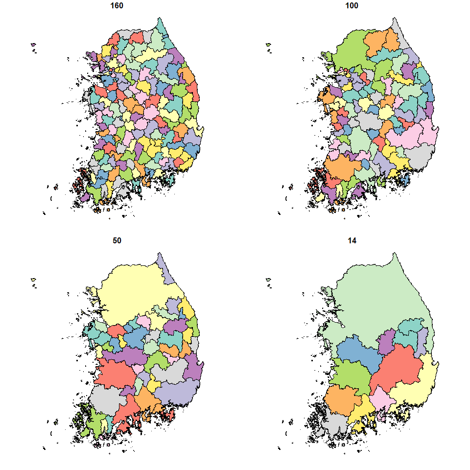

# Introduction to flowbcaR

### *Jongjin Yun (2025-07-24)*

`flowbcaR` is an R implementation of the Stata package `flowbca`, a
hierarchical clustering algorithm for flow data. This package is used to
identify functional regions by analyzing interactions (e.g., population
movement) between spatial units such as administrative districts.
Additionally, `flowbcaR` provides various functions to help understand
the algorithm’s results.

## Background and Methodology

`flowbcaR` is based on the `flowbca` algorithm for Stata developed by
Meekes and Hassink (2018). This algorithm is an agglomerative
hierarchical clustering method that focuses on the **flow** between
units.

The core idea of the algorithm is as follows:

1.  **Initial State**: Starts with all individual units (e.g., regions)
    as separate clusters.
2.  **Optimization Function**: At each step, it evaluates the
    bidirectional flow between all pairs of units. The optimization
    function identifies the two units with the strongest interaction.
    The flow can be evaluated based on the following criteria:
    -   **Directionality**: Sum of directed or undirected flows.
    -   **Scale**: Absolute flow volume or relative flow volume compared
        to total outflow.
3.  **Merging**: Based on the optimization function, the source unit is
    merged into the destination unit that receives the larger flow. The
    destination unit is defined as the core.
4.  **Iteration**: Steps 2-3 are repeated until all units form a single
    cluster or a user-defined stopping condition (e.g., target number of
    clusters, minimum flow threshold) is met.

This methodology can be useful in various fields such as regional
economic analysis, industrial linkage analysis, and social network
analysis. After clustering, the self-containment of the formed clusters
can be evaluated using indicators like the internal relative flow.

## Analysis Workflow

The functions in `flowbcaR` follow a systematic analysis flow. Each
function uses the output of the previous step as input to progressively
refine the analysis. A typical workflow is as follows.

1.  **`flowbca()`**: Performs clustering using the original flow data
    (`OD_SiGun`). The output is a list containing `unit_set`,
    `cluster_set`, `F_matrix_history`, etc.
2.  **`build_hierarchy()`**: Takes the `unit_set` from `flowbca()` to
    generate a text-based hierarchy of how each unit is merged. The
    merge hierarchy can be easily understood as a tree structure in text
    form using the data.tree package.
3.  **`flowbca_stat()`**: Uses the `F_matrix_history` from `flowbca()`
    to calculate the statistical properties of each clustering step. It
    provides the mean, median, maximum, and minimum values for the
    self-containment of the clusters.
4.  **`flowbca_plot()`**: Visualizes the results of `flowbca_stat()` to
    show the change in cluster cohesion. It is dynamically implemented
    to display values when the `upper_bound` is less than 20.
5.  **`flowbca_gis()`**: Combines the `unit_set` from `flowbca()` with
    the original spatial data (`KR_SiGun`) to create a map layer for
    each clustering step. It provides a map for visualization by
    removing holes inside the merged polygons.
6.  **`flowbca_ani()`**: Collects the map layers created by
    `flowbca_gis()` to create a dynamic GIF animation of the clustering
    process. It shows the merging process according to the steps.

The diagram below visually represents the relationships between these
functions and the data flow. Using the results of the `flowbca()`
function, it generates a hierarchical structure, statistics and
visualizations for cluster self-containment, and GIS data and animations
for visualization.

## Sample Data

This package includes two example datasets based on the Si-Gun units of
South Korea. You can load them using the `data()` command.

-   **`OD_SiGun`**: Origin-Destination (OD) data representing the
    traffic volume between 159 Si-Gun units.
-   **`KR_SiGun`**: `sf` spatial data containing the administrative
    boundaries of the 159 Si-Gun units.

Before inputting the data into the `flowbca()` function, a preprocessing
step is needed to format it correctly. `flowbca()` requires a data.frame
in the form of an Origin-Destination matrix. The `OD_SiGun` data
includes both the origin code (`SiGun_CD`) and name (`SiGun_NM`), but
the function only needs **one column** representing the origin ID.

Also, the origin ID in the first column must exactly match the
destination IDs (column names) in the remaining columns. Here, we use
`SiGun_NM` as the ID and prepare the data by removing the unnecessary
`SiGun_CD` column.

    library(flowbcaR)
    library(sf)
    #> Warning: package 'sf' was built under R version 4.4.2
    #> Linking to GEOS 3.12.2, GDAL 3.9.3, PROJ 9.4.1; sf_use_s2() is TRUE

    # Load the sample datasets
    data(OD_SiGun)
    data(KR_SiGun)

    # Prepare the flow data for the algorithm
    # The first column must be the source unit ID, and the destination column
    # names must match the source unit IDs.
    # We remove the first column ("SiGun_CD") to meet this requirement.
    flow_input <- OD_SiGun[, -1]
    colnames(flow_input) <- c('SiGun_NM',flow_input[,1])

    # Check the prepared data
    print("Prepared OD Data for flowbca:")
    #> [1] "Prepared OD Data for flowbca:"
    print(flow_input[1:5, 1:6])
    #>   SiGun_NM       Seoul      Busan     Daegu      Gunwi      Incheon
    #> 1    Seoul      0.0000 16171.4811 11146.857   88.40104 368358.14742
    #> 2    Busan  15730.4194     0.0000  9497.000  178.31485   1902.12199
    #> 3    Daegu  10831.0608  8518.5377     0.000 5281.25091   1216.73656
    #> 4    Gunwi    110.2699   126.1911  5000.186    0.00000     33.69141
    #> 5  Incheon 360859.4975  1404.4627  1003.667   20.21733      0.00000
    print(head(KR_SiGun))
    #> Simple feature collection with 6 features and 2 fields
    #> Geometry type: GEOMETRY
    #> Dimension:     XY
    #> Bounding box:  xmin: 746111 ymin: 1660757 xmax: 1164133 ymax: 2001991
    #> Projected CRS: KGD2002 / Unified CS
    #>   SiGun_CD SiGun_NM                           geom
    #> 1       11    Seoul POLYGON ((949431.3 1939061,...
    #> 2       21    Busan MULTIPOLYGON (((1133178 167...
    #> 3       22    Daegu POLYGON ((1106848 1755473, ...
    #> 4       23  Incheon MULTIPOLYGON (((927769.5 19...
    #> 5       24  Gwangju POLYGON ((954859.6 1680843,...
    #> 6       25  Daejeon POLYGON ((993018.2 1801216,...

## Core Functions

The `flowbcaR` package provides several core functions for data
clustering, hierarchy generation, statistical analysis, and
visualization.

### `flowbca()`

This is the core function that performs hierarchical clustering based on
flow data. It follows the logic of Stata’s `flowbca.ado` and allows
setting various merging criteria and stopping conditions.

-   **`data`**: A data frame where the first column is the origin ID and
    the rest are flow volumes by destination.
-   **`q`**: The minimum flow threshold for merging clusters. A relative
    threshold is specified as a ratio, and an absolute threshold is
    specified as an integer. If the specified threshold is greater than
    the maximum value in the entire flow data, the algorithm’s stopping
    condition is met, and the procedure terminates. The default is
    `q = 0`.
-   **`k`**: The target number of clusters.
-   **`opt_f`**: The optimization function (1-4). Four options are
    available.
    -   `opt_f = 1`: directed relative flows approach (default).
    -   `opt_f = 2`: undirected relative flows approach.
    -   `opt_f = 3`: directed absolute flows approach.
    -   `opt_f = 4`: undirected absolute flows approach.
-   **`la`, `lw`, `lm`**: Additional stopping conditions based on the
    internal relative flow ratio.
    -   la: the minimum average of the internal relative flows.
    -   lw: the minimum weighted average of the internal relative flows.
    -   lm: the minimum internal relative flow.
-   **`save_k`**: Whether to return the F\_matrix for all rounds. The
    default is FALSE.

<!-- -->

    # The 'flow_input' data was prepared in the chunk above.
    # We will run the clustering until the minimum internal relative flow ratio exceeds 10%.
    # By setting lm to 0.1, we ensure that all objects include more than one Si and Gun.
    bca_result <- flowbca(flow_input, lm=0.1, save_k = TRUE)
    #> Stopping: Condition (la, lw, or lm) met.

    # The result is a list containing:
    # 1. unit_set: Details of cluster assignment for each unit
    # 2. cluster_set: Statistics for the final clusters
    # 3. F_matrix: The final aggregated flow matrix
    # 4. F_matrix_history: A list of matrices from each clustering round
    str(bca_result$unit_set, 3)
    #> 'data.frame':    159 obs. of  6 variables:
    #>  $ sourceunit     : chr  "Seoul" "Busan" "Daegu" "Gunwi" ...
    #>  $ clusterid      : chr  "Seoul" "Busan" "Daegu" "Daegu" ...
    #>  $ destinationunit: chr  NA NA NA "Daegu" ...
    #>  $ g              : num  NA NA NA 0.393 0.594 ...
    #>  $ round          : int  NA NA NA 41 101 NA NA 115 49 79 ...
    #>  $ core           : num  1 1 1 0 0 1 1 0 0 0 ...
    str(bca_result$cluster_set, 3)
    #> 'data.frame':    13 obs. of  8 variables:
    #>  $ clusterid        : chr  "Seoul" "Busan" "Daegu" "Gwangju" ...
    #>  $ internal         : num  16091461 1478652 1019695 285361 517083 ...
    #>  $ rowflows         : num  16607708 1748088 1237943 456819 848576 ...
    #>  $ internal_relative: num  0.969 0.846 0.824 0.625 0.609 ...
    #>  $ La               : num  0.6 0.6 0.6 0.6 0.6 ...
    #>  $ Lw               : num  0.91 0.91 0.91 0.91 0.91 ...
    #>  $ Lm               : num  0.205 0.205 0.205 0.205 0.205 ...
    #>  $ N                : num  22376808 22376808 22376808 22376808 22376808 ...

### `build_hierarchy()`

Uses the `unit_set` from the `flowbca` result to generate a hierarchical
path showing how each unit is merged into a higher-level cluster.

-   **`data`**: The `unit_set` data frame from the `flowbca` result.
-   **`child_col`**: The column name for the child unit (default:
    “sourceunit”).
-   **`parent_col`**: The column name for the parent unit (default:
    “destinationunit”).

<!-- -->

    # Build the hierarchy path from the result
    hierarchy_data <- build_hierarchy(bca_result$unit_set)

    # View the hierarchy for a few units
    # 'hierarchy' column shows the full merge path
    # 'h_level' shows the depth in the hierarchy
    head(hierarchy_data[, c("sourceunit", "clusterid", "hierarchy", "h_level")])
    #>   sourceunit clusterid     hierarchy h_level
    #> 1      Seoul     Seoul         Seoul       1
    #> 2      Busan     Busan         Busan       1
    #> 3      Daegu     Daegu         Daegu       1
    #> 4      Gunwi     Daegu   Daegu/Gunwi       2
    #> 5    Incheon     Seoul Seoul/Incheon       2
    #> 6    Gwangju   Gwangju       Gwangju       1

You can visualize the cluster hierarchy as text using the data.tree
package.

    library(data.tree)
    #> Warning: package 'data.tree' was built under R version 4.4.3
    # data.tree package
    node <- paste0('nation/', hierarchy_data$hierarchy)
    tree <- data.tree::as.Node(data.frame(pathString=node))

    ## Tree structure of the cluster hierarchy
    print(tree, 'level', limit=10)
    #>                          levelName level
    #> 1  nation                              1
    #> 2   ¦--Seoul                           2
    #> 3   ¦   ¦--Incheon                     3
    #> 4   ¦   ¦--Suwon                       3
    #> 5   ¦   ¦--Seongnam                    3
    #> 6   ¦   ¦--Uijeongbu                   3
    #> 7   ¦   ¦--Anyang                      3
    #> 8   ¦   ¦--Bucheon                     3
    #> 9   ¦   ¦--Gwangmyeong                 3
    #> 10  ¦   °--... 49 nodes w/ 13 sub     3
    #> 11  °--... 12 nodes w/ 139 sub        2

    ## Explore the sub-tree structure for Busan
    print(tree$Busan)
    #>                         levelName
    #> 1  Busan                         
    #> 2   ¦--Ulsan                     
    #> 3   ¦--Gyeongju                  
    #> 4   ¦   °--Pohang               
    #> 5   ¦--Geoje                     
    #> 6   ¦   °--Tongyeong            
    #> 7   ¦--Gimhae                    
    #> 8   ¦--Miryang                   
    #> 9   ¦--Yangsan                   
    #> 10  ¦--Changwon                  
    #> 11  ¦   ¦--Uiryeong              
    #> 12  ¦   °--Haman                
    #> 13  ¦--Changnyeong               
    #> 14  °--Goseong(Gyeongsangnam-do)

### `flowbca_stat()` & `flowbca_plot()`

Calculates and visualizes statistics of the internal flow ratio for each
step (round) of the clustering process. This helps to understand how the
cohesion of the clusters changes.

-   **`flowbca_stat(matrix_list)`**: Takes the `F_matrix_history` from
    the `flowbca` result as input and calculates the mean, minimum,
    median, and maximum internal flow ratios for each round.
-   **`flowbca_plot(stat_data)`**: Uses the data generated by
    `flowbca_stat` to plot the statistics.

<!-- -->

    # Calculate internal flow statistics from the matrix history
    stat_data <- flowbca_stat(bca_result$F_matrix_history)
    head(stat_data)
    #>   round        mean min median       max
    #> 1   159 0.003328583   0      0 0.5259161
    #> 2   158 0.004291168   0      0 0.5259161
    #> 3   157 0.004675754   0      0 0.5816204
    #> 4   156 0.004954357   0      0 0.6201281
    #> 5   155 0.006154231   0      0 0.6201281
    #> 6   154 0.009344017   0      0 0.6201281

    # Plot the statistics
    # The x-axis represents the number of clusters + 1
    par(mfrow = c(1, 2))
    flowbca_plot(stat_data, upper_bound = 50)
    flowbca_plot(stat_data, upper_bound = 20)

### `flowbca_gis()`

Combines the clustering results from `flowbca` with spatial data (`sf`
object) to create merged polygon layers for each merging step.

-   **`unit_set`**: The `unit_set` from the `flowbca` result.
-   **`unit_gis`**: The `sf` spatial data of the original units.
-   **`join_col`**: The column name to use when joining the two
    datasets. (e.g., `join_col = c('sourceunit' = 'SiGun_NM')`)

<!-- -->

    # Generate merged spatial layers for each round
    # This can take a moment
    gis_layers <- flowbca_gis(bca_result$unit_set, KR_SiGun, join_col=c('sourceunit'='SiGun_NM'))
    #> Processed round: 159 (Step: 1 )
    #> Processed round: 158 (Step: 2 )
    #> Processed round: 157 (Step: 3 )
    #> Processed round: 156 (Step: 4 )
    #> Processed round: 155 (Step: 5 )
    #> Processed round: 154 (Step: 6 )
    ..................................
    #> Processed round: 23 (Step: 137 )
    #> Processed round: 22 (Step: 138 )
    #> Processed round: 21 (Step: 139 )
    #> Processed round: 20 (Step: 140 )
    #> Processed round: 19 (Step: 141 )
    #> Processed round: 18 (Step: 142 )
    #> Processed round: 17 (Step: 143 )
    #> Processed round: 16 (Step: 144 )
    #> Processed round: 15 (Step: 145 )
    #> Processed round: 14 (Step: 146 )

    # The result is a named list of sf objects
    # The names correspond to the round number (number of clusters + 1)
    print(paste("Number of spatial layers created:", length(gis_layers)))
    #> [1] "Number of spatial layers created: 147"

    # Plot the final clustered boundaries
    # The colors for each round are assigned arbitrarily
    par(mfrow = c(2, 2),       
        mar = c(0.1, 0.1, 1, 0.1),
        oma = c(0, 0, 0, 0),
        xpd = NA)
    plot(gis_layers$`160`["sourceunit"],key.pos = NULL,reset = FALSE,main = "160",asp=NA)
    plot(gis_layers$`100`["sourceunit"],key.pos = NULL,reset = FALSE,main = "100",asp=NA)
    plot(gis_layers$`50`["sourceunit"],key.pos = NULL,reset = FALSE,main = "50",asp=NA)
    plot(gis_layers$`14`["sourceunit"],key.pos = NULL,reset = FALSE,main = "14",asp=NA)

### `flowbca_ani()`

Uses the list of spatial layers generated by `flowbca_gis` to create a
GIF animation showing the clustering process.

-   **`flowbca_gis`**: The result from the `flowbca_gis` function.
-   **`unit_set`**: The `unit_set` from the `flowbca` result.
-   **`filenm`**: The file name for the saved GIF.
-   **`width`**: The width of the saved GIF in pixels. The default is
    1000px.
-   **`keep_frames`**: Creates a folder in the current path and saves
    all frames for the PNG. The default is FALSE.

<!-- -->

    # This code is not evaluated in the README build to save time,
    # but you can run it locally.
    # It will create a file named "flowbca_clustering.gif" in your working directory.

    flowbca_ani(
      flowbca_gis = gis_layers,
      unit_set = bca_result$unit_set,
      filenm = "flowbca_clustering.gif",
      width = 800
    )

## References

Meekes, J., & Hassink, W. H. J. (2018). flowbca: A flow-based cluster
algorithm in Stata. *The Stata Journal*, *18*(3), 564–584.
