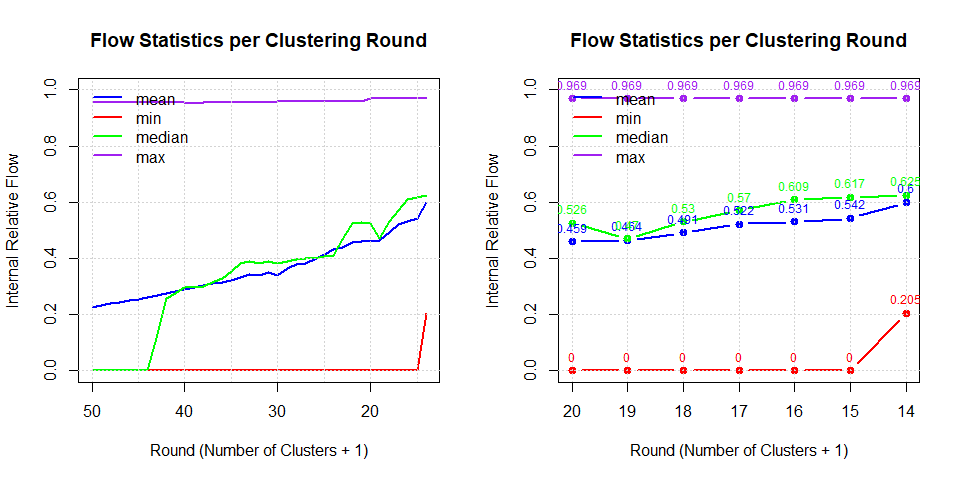

<!-- README.md is generated from README.Rmd. Please edit that file -->

# flowbcaR

<!-- badges: start -->

<!-- badges: end -->

`flowbcaR`은 Stata 패키지 `flowbca`를 R로 번역한 것으로, 흐름 데이터를
위한 계층적 클러스터링 알고리즘입니다. 이 패키지는 행정 구역과 같은 공간
단위 간의 상호작용(예: 인구 이동)을 분석하여 기능적 권역을 식별하는 데
사용됩니다. 또한, flowbcaR에서는 알고리즘 결과를 이해하기 위한 다양한
함수를 추가로 제공합니다.

## Background and Methodology

`flowbcaR`는 Meekes and Hassink (2018)가 개발한 Stata용 `flowbca`
알고리즘에 기반합니다. 이 알고리즘은 단위 간의 **흐름(flow)**에 초점을
맞춘 응집형 계층적 클러스터링(agglomerative hierarchical clustering)
방법입니다.

알고리즘의 핵심 아이디어는 다음과 같습니다:

1.  **초기 상태**: 모든 개별 단위(예: 지역)를 별개의 클러스터로
    시작합니다.
2.  **최적화 함수**: 각 단계에서 모든 단위 쌍 간의 양방향 흐름을
    평가합니다. 최적화 함수는 가장 강한 상호작용을 보이는 두 단위를
    식별합니다. 이때 흐름은 다음과 같은 기준으로 평가될 수 있습니다.
    - **방향성**: 단방향(directed) 흐름 또는 양방향(undirected) 흐름의
      합.
    - **척도**: 절대적(absolute) 흐름량 또는 총 유출량 대비
      상대적(relative) 흐름량.
3.  **병합**: 최적화 함수에 따라 선택된 두 단위 중, 더 큰 흐름을 받는
    단위(destination unit)를 중심으로 다른 단위(source unit)가
    병합됩니다. 이때, 받는 단위(destination unit)는 중심지(core)로
    정의됩니다.
4.  **반복**: 모든 단위가 하나의 클러스터가 되거나, 사용자가 지정한 중단
    조건(예: 목표 클러스터 개수, 최소 흐름 임계값)이 충족될 때까지
    2-3단계를 반복합니다.

이 방법론은 지역 경제권 분석, 산업 연관 분석, 사회 연결망 분석 등 다양한
분야에서 유용하게 사용될 수 있습니다. 클러스터링 후에는 내부 흐름
비율(internal relative flow)과 같은 지표를 통해 형성된 클러스터의
자족성(self-containment)을 평가할 수 있습니다.

## Installation

개발 버전은 [GitHub](https://github.com/)에서 다음 명령어로 설치할 수
있습니다:

``` r
# install.packages("pak")
pak::pak("urbanjj/Rflowbca")
```

## Analysis Workflow

`flowbcaR`의 함수들은 체계적인 분석 흐름을 따릅니다. 각 함수는 이전
단계의 출력을 입력으로 사용하여 점진적으로 분석을 구체화합니다. 일반적인
작업 흐름은 다음과 같습니다.

1.  **`flowbca()`**: 원본 흐름 데이터(`OD_SiGun`)를 사용하여
    클러스터링을 수행합니다. 결과물은 `unit_set`, `cluster_set`,
    `F_matrix_history` 등을 포함하는 리스트입니다.
2.  **`build_hierarchy()`**: `flowbca()`의 `unit_set`을 받아 각 단위의
    병합 계층을 텍스트로 생성합니다. 병합계층은 data.tree 패키지를
    사용해 text 형태로 tree구조를 쉽게 파악할 수 있습니다.
3.  **`flowbca_stat()`**: `flowbca()`의 `F_matrix_history`를 사용하여
    클러스터링 각 단계의 통계적 특성을 계산합니다. 클러스터의
    자족성(self-containment)에 대한 평균, 중간값, 최대값, 최소값 등을
    제시합니다.
4.  **`flowbca_plot()`**: `flowbca_stat()`의 결과를 시각화하여 클러스터
    응집력의 변화를 보여줍니다. upper_bound 수가 20개 미만일 때 값이
    표현되도록 동적으로 구현되어 있습니다.
5.  **`flowbca_gis()`**: `flowbca()`의 `unit_set`과 원본 공간
    데이터(`KR_SiGun`)를 결합하여 각 클러스터링 단계에 해당하는 지도
    레이어를 생성합니다. 병합된 polygon 내부의 구멍(hole)을 제거해
    시각화를 위한 지도를 제공합니다.
6.  **`flowbca_ani()`**: `flowbca_gis()`가 만든 지도 레이어들을 모아
    클러스터링 과정을 동적인 GIF 애니메이션으로 만듭니다. 단계에 따라
    병합되는 과정을 알 수 있습니다.

아래 다이어그램은 이러한 함수 간의 관계와 데이터 흐름을 시각적으로
보여줍니다. `flowbca()` 함수의 결과물을 활용하여, 계층적 구조,
클러스터의 자족성에 대한 통계 및 시각화, 시각화를 위한 gis 자료와
애니메이션을 생성합니다.


## Sample Data

이 패키지에는 대한민국의 시군(Si-Gun) 단위를 기준으로 한 두 개의 예제
데이터셋이 포함되어 있습니다. `data()` 명령어를 사용하여 불러올 수
있습니다.

- **`OD_SiGun`**: 159개 시군 간의 통행량을 나타내는
  OD(Origin-Destination) 데이터입니다.
- **`KR_SiGun`**: 159개 시군의 행정구역 경계를 담고 있는 `sf` 공간
  데이터입니다.

`flowbca()` 함수에 데이터를 입력하기 전, 올바른 형식으로 맞춰주는 전처리
과정이 필요합니다. `flowbca()`는 Origin-Destination matrix 형태의
data.frame이 입력되어야 합니다. `OD_SiGun` 데이터에는 출발지
코드(`SiGun_CD`)와 이름(`SiGun_NM`)이 모두 포함되어 있지만, 함수는
출발지 ID를 나타내는 **하나의 열**만 필요합니다.

또한, 첫 번째 열의 출발지 ID와 나머지 열의 목적지 ID(열 이름)가 정확히
일치해야 합니다. 여기서는 `SiGun_NM`를 ID로 사용하고, 불필요한
`SiGun_CD` 열을 제거하여 데이터를 준비합니다.

``` r
library(flowbcaR)
library(sf)
#> Warning: package 'sf' was built under R version 4.4.2
#> Linking to GEOS 3.12.2, GDAL 3.9.3, PROJ 9.4.1; sf_use_s2() is TRUE

# Load the sample datasets
data(OD_SiGun)
data(KR_SiGun)

# Prepare the flow data for the algorithm
# The first column must be the source unit ID, and the destination column
# names must match the source unit IDs.
# We remove the first column ("SiGun_CD") to meet this requirement.
flow_input <- OD_SiGun[, -1]
colnames(flow_input) <- c('SiGun_NM',flow_input[,1])

# Check the prepared data
print("Prepared OD Data for flowbca:")
#> [1] "Prepared OD Data for flowbca:"
print(flow_input[1:5, 1:6])
#>   SiGun_NM       Seoul      Busan     Daegu      Gunwi      Incheon
#> 1    Seoul      0.0000 16171.4811 11146.857   88.40104 368358.14742
#> 2    Busan  15730.4194     0.0000  9497.000  178.31485   1902.12199
#> 3    Daegu  10831.0608  8518.5377     0.000 5281.25091   1216.73656
#> 4    Gunwi    110.2699   126.1911  5000.186    0.00000     33.69141
#> 5  Incheon 360859.4975  1404.4627  1003.667   20.21733      0.00000

print("\nGIS Data:")
#> [1] "\nGIS Data:"
print(head(KR_SiGun))
#> Simple feature collection with 6 features and 2 fields
#> Geometry type: GEOMETRY
#> Dimension:     XY
#> Bounding box:  xmin: 746111 ymin: 1660757 xmax: 1164133 ymax: 2001991
#> Projected CRS: KGD2002 / Unified CS
#>   SiGun_CD SiGun_NM                           geom
#> 1       11    Seoul POLYGON ((949431.3 1939061,...
#> 2       21    Busan MULTIPOLYGON (((1133178 167...
#> 3       22    Daegu POLYGON ((1106848 1755473, ...
#> 4       23  Incheon MULTIPOLYGON (((927769.5 19...
#> 5       24  Gwangju POLYGON ((954859.6 1680843,...
#> 6       25  Daejeon POLYGON ((993018.2 1801216,...
```

## Core Functions

`flowbcaR` 패키지는 데이터 클러스터링, 계층 구조 생성, 통계 분석 및
시각화를 위한 여러 핵심 함수를 제공합니다.

### `flowbca()`

흐름 데이터를 기반으로 계층적 클러스터링을 수행하는 핵심 함수입니다.
Stata의 `flowbca.ado` 로직을 따르며, 다양한 병합 기준과 중단 조건을
설정할 수 있습니다.

- **`data`**: 첫 번째 열이 출발지 ID이고 나머지가 목적지별 흐름량인
  데이터 프레임.
- **`q`**: 클러스터 병합을 위한 최소 흐름량 임계값. 상대적 임계값은
  비율로, 절대적 임계값은 정수로 지정합니다. 만약 지정한 임계값이 전체
  흐름 값 중 최대값보다 크면, 알고리즘의 중지 조건이 충족되어 절차가
  종료됩니다. 기본값은 q(0)입니다.
- **`k`**: 목표 클러스터 개수.
- **`opt_f`**: 최적화 함수 (1-4). 4개의 옵션이 가능합니다.
- opt_f(1): directed relative flows approach, 기본값에 해당함.
- opt_f(2): undirected relative flows approach
- opt_f(3): directed absolute flows approach
- opt_f(4): undirected absolute flows approach
- **`la`, `lw`, `lm`**: 내부 흐름 비율에 기반한 추가적인 중단 조건.
- la: the minimum average of the internal relative flows.
- lw: the minimum weighted average of the internal relative flows.
- lm: the minimum internal relative flow.
- **`save_k`** : 모든 round에 대한 F_matrix를 반환할지 여부. 기본값은
  FALSE임.

``` r
# The 'flow_input' data was prepared in the chunk above.
# We will run the clustering until the minimum internal relative flow ratio exceeds 10%.
# By setting lm to 0.1, we ensure that all objects include more than one Si and Gun.
bca_result <- flowbca(flow_input, lm=0.1, save_k = TRUE)
#> Stopping: Condition (la, lw, or lm) met.

# The result is a list containing:
# 1. unit_set: Details of cluster assignment for each unit
# 2. cluster_set: Statistics for the final clusters
# 3. F_matrix: The final aggregated flow matrix
# 4. F_matrix_history: A list of matrices from each clustering round
str(bca_result$unit_set, 3)
#> 'data.frame':    159 obs. of  6 variables:
#>  $ sourceunit     : chr  "Seoul" "Busan" "Daegu" "Gunwi" ...
#>  $ clusterid      : chr  "Seoul" "Busan" "Daegu" "Daegu" ...
#>  $ destinationunit: chr  NA NA NA "Daegu" ...
#>  $ g              : num  NA NA NA 0.393 0.594 ...
#>  $ round          : int  NA NA NA 41 101 NA NA 115 49 79 ...
#>  $ core           : num  1 1 1 0 0 1 1 0 0 0 ...
str(bca_result$cluster_set, 3)
#> 'data.frame':    13 obs. of  8 variables:
#>  $ clusterid        : chr  "Seoul" "Busan" "Daegu" "Gwangju" ...
#>  $ internal         : num  16091461 1478652 1019695 285361 517083 ...
#>  $ rowflows         : num  16607708 1748088 1237943 456819 848576 ...
#>  $ internal_relative: num  0.969 0.846 0.824 0.625 0.609 ...
#>  $ La               : num  0.6 0.6 0.6 0.6 0.6 ...
#>  $ Lw               : num  0.91 0.91 0.91 0.91 0.91 ...
#>  $ Lm               : num  0.205 0.205 0.205 0.205 0.205 ...
#>  $ N                : num  22376808 22376808 22376808 22376808 22376808 ...
```

### `build_hierarchy()`

`flowbca` 결과의 `unit_set`을 사용하여 각 단위(unit)가 어떻게 상위
클러스터에 병합되는지를 보여주는 계층 경로를 생성합니다.

- **`data`**: `flowbca` 결과의 `unit_set` 데이터 프레임.
- **`child_col`**: 자식 단위 열 이름 (기본값: “sourceunit”).
- **`parent_col`**: 부모 단위 열 이름 (기본값: “destinationunit”).

``` r
# Build the hierarchy path from the result
hierarchy_data <- build_hierarchy(bca_result$unit_set)

# View the hierarchy for a few units
# 'hierarchy' column shows the full merge path
# 'h_level' shows the depth in the hierarchy
head(hierarchy_data[, c("sourceunit", "clusterid", "hierarchy", "h_level")])
#>   sourceunit clusterid     hierarchy h_level
#> 1      Seoul     Seoul         Seoul       1
#> 2      Busan     Busan         Busan       1
#> 3      Daegu     Daegu         Daegu       1
#> 4      Gunwi     Daegu   Daegu/Gunwi       2
#> 5    Incheon     Seoul Seoul/Incheon       2
#> 6    Gwangju   Gwangju       Gwangju       1
```

data.tree 패키지를 활용해 클러스터의 hierarchy를 text로 시각화할 수
있습니다.

``` r
library(data.tree)
#> Warning: package 'data.tree' was built under R version 4.4.3
# data.tree 패키지
node <- paste0('nation/', hierarchy_data$hierarchy)
tree <- data.tree::as.Node(data.frame(pathString=node))

## 클러스터의 hierarchy의 tree 구조
print(tree, 'level', limit=10)
#>                          levelName level
#> 1  nation                              1
#> 2   ¦--Seoul                           2
#> 3   ¦   ¦--Incheon                     3
#> 4   ¦   ¦--Suwon                       3
#> 5   ¦   ¦--Seongnam                    3
#> 6   ¦   ¦--Uijeongbu                   3
#> 7   ¦   ¦--Anyang                      3
#> 8   ¦   ¦--Bucheon                     3
#> 9   ¦   ¦--Gwangmyeong                 3
#> 10  ¦   °--... 49 nodes w/ 13 sub     3
#> 11  °--... 12 nodes w/ 139 sub        2

## Busan에 대한 하위 tree구조를 탐색
print(tree$Daegu)
#>           levelName
#> 1  Daegu           
#> 2   ¦--Gunwi       
#> 3   ¦--Gumi        
#> 4   ¦   ¦--Gimcheon
#> 5   ¦   °--Chilgok
#> 6   ¦--Yeongcheon  
#> 7   ¦--Gyeongsan   
#> 8   ¦--Uiseong     
#> 9   ¦--Cheongdo    
#> 10  ¦--Goryeong    
#> 11  ¦--Seongju     
#> 12  ¦--Hamyang     
#> 13  ¦--Geochang    
#> 14  °--Hapcheon
```

### `flowbca_stat()` & `flowbca_plot()`

클러스터링 과정의 각 단계(round)별로 내부 흐름 비율의 통계를 계산하고
시각화합니다. 이를 통해 클러스터의 응집력이 어떻게 변하는지 파악할 수
있습니다.

- **`flowbca_stat(matrix_list)`**: `flowbca` 결과의 `F_matrix_history`를
  입력받아 각 라운드별 평균, 최소, 중앙, 최대 내부 흐름 비율을
  계산합니다.
- **`flowbca_plot(stat_data)`**: `flowbca_stat`이 생성한 데이터를
  사용하여 통계치를 그래프로 그립니다.

``` r
# Calculate internal flow statistics from the matrix history
stat_data <- flowbca_stat(bca_result$F_matrix_history)
head(stat_data)
#>   round        mean min median       max
#> 1   159 0.003328583   0      0 0.5259161
#> 2   158 0.004291168   0      0 0.5259161
#> 3   157 0.004675754   0      0 0.5816204
#> 4   156 0.004954357   0      0 0.6201281
#> 5   155 0.006154231   0      0 0.6201281
#> 6   154 0.009344017   0      0 0.6201281

# Plot the statistics
# The x-axis represents the number of clusters + 1
par(mfrow = c(1, 2))
flowbca_plot(stat_data, upper_bound = 50)
flowbca_plot(stat_data, upper_bound = 20)
```



### `flowbca_gis()`

`flowbca`의 클러스터링 결과를 공간 데이터(`sf` 객체)와 결합하여 각 병합
단계별로 통합된 폴리곤 레이어를 생성합니다.

- **`unit_set`**: `flowbca` 결과의 `unit_set`.
- **`unit_gis`**: 원본 단위의 `sf` 공간 데이터.
- **`join_col`**: 두 데이터를 결합할 때 사용할 열 이름.
- (예) join_col = c(‘join column name of unit_set’, ‘join column name of
  unit_gis’)

``` r
# Generate merged spatial layers for each round
# This can take a moment
gis_layers <- flowbca_gis(bca_result$unit_set, KR_SiGun, join_col=c('sourceunit'='SiGun_NM'))
#> Processed round: 159 (Step: 1 )
#> Processed round: 158 (Step: 2 )
#> Processed round: 157 (Step: 3 )
#> Processed round: 156 (Step: 4 )
#> Processed round: 155 (Step: 5 )
#> Processed round: 154 (Step: 6 )
#> Processed round: 153 (Step: 7 )
#> Processed round: 152 (Step: 8 )
#> Processed round: 151 (Step: 9 )
#> Processed round: 150 (Step: 10 )
#> Processed round: 149 (Step: 11 )
#> Processed round: 148 (Step: 12 )
#> Processed round: 147 (Step: 13 )
#> Processed round: 146 (Step: 14 )
#> Processed round: 145 (Step: 15 )
#> Processed round: 144 (Step: 16 )
#> Processed round: 143 (Step: 17 )
#> Processed round: 142 (Step: 18 )
#> Processed round: 141 (Step: 19 )
#> Processed round: 140 (Step: 20 )
#> Processed round: 139 (Step: 21 )
#> Processed round: 138 (Step: 22 )
#> Processed round: 137 (Step: 23 )
#> Processed round: 136 (Step: 24 )
#> Processed round: 135 (Step: 25 )
#> Processed round: 134 (Step: 26 )
#> Processed round: 133 (Step: 27 )
#> Processed round: 132 (Step: 28 )
#> Processed round: 131 (Step: 29 )
#> Processed round: 130 (Step: 30 )
#> Processed round: 129 (Step: 31 )
#> Processed round: 128 (Step: 32 )
#> Processed round: 127 (Step: 33 )
#> Processed round: 126 (Step: 34 )
#> Processed round: 125 (Step: 35 )
#> Processed round: 124 (Step: 36 )
#> Processed round: 123 (Step: 37 )
#> Processed round: 122 (Step: 38 )
#> Processed round: 121 (Step: 39 )
#> Processed round: 120 (Step: 40 )
#> Processed round: 119 (Step: 41 )
#> Processed round: 118 (Step: 42 )
#> Processed round: 117 (Step: 43 )
#> Processed round: 116 (Step: 44 )
#> Processed round: 115 (Step: 45 )
#> Processed round: 114 (Step: 46 )
#> Processed round: 113 (Step: 47 )
#> Processed round: 112 (Step: 48 )
#> Processed round: 111 (Step: 49 )
#> Processed round: 110 (Step: 50 )
#> Processed round: 109 (Step: 51 )
#> Processed round: 108 (Step: 52 )
#> Processed round: 107 (Step: 53 )
#> Processed round: 106 (Step: 54 )
#> Processed round: 105 (Step: 55 )
#> Processed round: 104 (Step: 56 )
#> Processed round: 103 (Step: 57 )
#> Processed round: 102 (Step: 58 )
#> Processed round: 101 (Step: 59 )
#> Processed round: 100 (Step: 60 )
#> Processed round: 99 (Step: 61 )
#> Processed round: 98 (Step: 62 )
#> Processed round: 97 (Step: 63 )
#> Processed round: 96 (Step: 64 )
#> Processed round: 95 (Step: 65 )
#> Processed round: 94 (Step: 66 )
#> Processed round: 93 (Step: 67 )
#> Processed round: 92 (Step: 68 )
#> Processed round: 91 (Step: 69 )
#> Processed round: 90 (Step: 70 )
#> Processed round: 89 (Step: 71 )
#> Processed round: 88 (Step: 72 )
#> Processed round: 87 (Step: 73 )
#> Processed round: 86 (Step: 74 )
#> Processed round: 85 (Step: 75 )
#> Processed round: 84 (Step: 76 )
#> Processed round: 83 (Step: 77 )
#> Processed round: 82 (Step: 78 )
#> Processed round: 81 (Step: 79 )
#> Processed round: 80 (Step: 80 )
#> Processed round: 79 (Step: 81 )
#> Processed round: 78 (Step: 82 )
#> Processed round: 77 (Step: 83 )
#> Processed round: 76 (Step: 84 )
#> Processed round: 75 (Step: 85 )
#> Processed round: 74 (Step: 86 )
#> Processed round: 73 (Step: 87 )
#> Processed round: 72 (Step: 88 )
#> Processed round: 71 (Step: 89 )
#> Processed round: 70 (Step: 90 )
#> Processed round: 69 (Step: 91 )
#> Processed round: 68 (Step: 92 )
#> Processed round: 67 (Step: 93 )
#> Processed round: 66 (Step: 94 )
#> Processed round: 65 (Step: 95 )
#> Processed round: 64 (Step: 96 )
#> Processed round: 63 (Step: 97 )
#> Processed round: 62 (Step: 98 )
#> Processed round: 61 (Step: 99 )
#> Processed round: 60 (Step: 100 )
#> Processed round: 59 (Step: 101 )
#> Processed round: 58 (Step: 102 )
#> Processed round: 57 (Step: 103 )
#> Processed round: 56 (Step: 104 )
#> Processed round: 55 (Step: 105 )
#> Processed round: 54 (Step: 106 )
#> Processed round: 53 (Step: 107 )
#> Processed round: 52 (Step: 108 )
#> Processed round: 51 (Step: 109 )
#> Processed round: 50 (Step: 110 )
#> Processed round: 49 (Step: 111 )
#> Processed round: 48 (Step: 112 )
#> Processed round: 47 (Step: 113 )
#> Processed round: 46 (Step: 114 )
#> Processed round: 45 (Step: 115 )
#> Processed round: 44 (Step: 116 )
#> Processed round: 43 (Step: 117 )
#> Processed round: 42 (Step: 118 )
#> Processed round: 41 (Step: 119 )
#> Processed round: 40 (Step: 120 )
#> Processed round: 39 (Step: 121 )
#> Processed round: 38 (Step: 122 )
#> Processed round: 37 (Step: 123 )
#> Processed round: 36 (Step: 124 )
#> Processed round: 35 (Step: 125 )
#> Processed round: 34 (Step: 126 )
#> Processed round: 33 (Step: 127 )
#> Processed round: 32 (Step: 128 )
#> Processed round: 31 (Step: 129 )
#> Processed round: 30 (Step: 130 )
#> Processed round: 29 (Step: 131 )
#> Processed round: 28 (Step: 132 )
#> Processed round: 27 (Step: 133 )
#> Processed round: 26 (Step: 134 )
#> Processed round: 25 (Step: 135 )
#> Processed round: 24 (Step: 136 )
#> Processed round: 23 (Step: 137 )
#> Processed round: 22 (Step: 138 )
#> Processed round: 21 (Step: 139 )
#> Processed round: 20 (Step: 140 )
#> Processed round: 19 (Step: 141 )
#> Processed round: 18 (Step: 142 )
#> Processed round: 17 (Step: 143 )
#> Processed round: 16 (Step: 144 )
#> Processed round: 15 (Step: 145 )
#> Processed round: 14 (Step: 146 )

# The result is a named list of sf objects
# The names correspond to the round number (number of clusters + 1)
print(paste("Number of spatial layers created:", length(gis_layers)))
#> [1] "Number of spatial layers created: 147"

# Plot the final clustered boundaries
# The colors for each round are assigned arbitrarily
par(mfrow = c(2, 2),       
    mar = c(0.1, 0.1, 1, 0.1),
    oma = c(0, 0, 0, 0),
    xpd = NA)
plot(gis_layers$`160`["sourceunit"],key.pos = NULL,reset = FALSE,main = "160",asp=NA)
plot(gis_layers$`100`["sourceunit"],key.pos = NULL,reset = FALSE,main = "100",asp=NA)
plot(gis_layers$`50`["sourceunit"],key.pos = NULL,reset = FALSE,main = "50",asp=NA)
plot(gis_layers$`14`["sourceunit"],key.pos = NULL,reset = FALSE,main = "14",asp=NA)
```


### `flowbca_ani()`

`flowbca_gis`가 생성한 공간 레이어 리스트를 사용하여 클러스터링 과정을
보여주는 GIF 애니메이션을 만듭니다.

- **`flowbca_gis`**: `flowbca_gis` 함수의 결과물.
- **`unit_set`**: `flowbca` 결과의 `unit_set`.
- **`filenm`**: 저장할 GIF 파일 이름.
- **`width`**: 저장할 GIF의 가로 픽셀 값. 기본값은 1000px.
- \*\*`keep_frames`: GIF에 대한 모든 frame을 현재 경로에 폴더를 생성하고
  저장. 기본값은 FALSE.

``` r
# This code is not evaluated in the README build to save time,
# but you can run it locally.
# It will create a file named "flowbca_clustering.gif" in your working directory.

flowbca_ani(
  flowbca_gis = gis_layers,
  unit_set = bca_result$unit_set,
  filenm = "flowbca_clustering.gif",
  width = 800
)
```

<figure>

<figcaption aria-hidden="true">Clustering Animation</figcaption>
</figure>

## References

Meekes, J., & Hassink, W. H. J. (2018). flowbca: A flow-based cluster
algorithm in Stata. *The Stata Journal*, *18*(3), 564–584.
